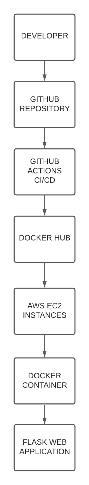

# AWS DevOps Starter Kit

Terraform + Docker + GitHub Actions CI/CD

This project demonstrates a complete DevOps workflow to deploy a containerized application on AWS using **Terraform**, **Docker**, and **GitHub Actions CI/CD**.

The infrastructure is created automatically and the application is deployed via a CI/CD pipeline.

---

# Features

• Infrastructure as Code using Terraform
• AWS VPC and EC2 infrastructure provisioning
• Dockerized Flask application
• GitHub Actions CI/CD pipeline
• Automatic deployment to AWS EC2
• Step-by-step setup instructions
• Architecture documentation

---

# Architecture



Deployment workflow:

Developer → GitHub → GitHub Actions → Docker Hub → AWS EC2 → Docker Container → Flask Application

---

# Project Structure

```text
aws-terraform-devops-starter
│
├── app/                   # Flask application and Docker configuration
│   ├── app.py
│   ├── requirements.txt
│   └── Dockerfile
│
├── terraform/             # Terraform infrastructure configuration
│   ├── main.tf
│   ├── variables.tf
│   └── outputs.tf
│
├── .github/workflows/     # GitHub Actions CI/CD pipeline
│   └── deploy.yml
│
├── README.md              # Project overview
├── SETUP_GUIDE.md         # Deployment instructions
├── SERVICES.md            # DevOps services offered
├── ARCHITECTURE.md        # Infrastructure explanation
├── architecture.png       # Architecture diagram
└── LICENSE
```

---

# Prerequisites

Before starting ensure you have:

• AWS Account
• Docker Hub Account
• GitHub Account
• Git installed
• Terraform installed
• AWS CLI installed

---

# Step 1 — Clone the Repository

```bash
git clone https://github.com/YOUR_USERNAME/aws-terraform-devops-starter.git
cd aws-terraform-devops-starter
```

---

# Step 2 — Configure AWS Credentials

Run:

```bash
aws configure
```

Enter your credentials:

```
AWS Access Key
AWS Secret Key
Region (example: us-east-1)
Output format: json
```

---

# Step 3 — Create AWS Key Pair

Go to:

AWS Console → EC2 → Key Pairs → Create Key Pair

Example name:

```
devops-key
```

Download the `.pem` file.

---

# Step 4 — Configure Terraform Variables

Open the Terraform variables file and update values if necessary.

Example values:

```
region = "us-east-1"
instance_type = "t2.micro"
key_name = "devops-key"
```

---

# Step 5 — Deploy Infrastructure

Terraform files are located inside the **terraform/** directory.

Run commands from that folder.

Initialize Terraform:

```bash
cd terraform
terraform init
```

Preview resources:

```bash
terraform plan
```

Deploy infrastructure:

```bash
terraform apply
```

Terraform will create:

• VPC
• Subnet
• Internet Gateway
• Route Table
• Security Group
• EC2 Instance

After deployment Terraform outputs:

```
website_ip
```

Example:

```
http://44.xxx.xxx.xxx
```

---

# Step 6 — Configure GitHub Repository

Push the project to GitHub.

Initialize git:

```bash
git init
```

Add files:

```bash
git add .
```

Commit:

```bash
git commit -m "Initial DevOps project"
```

Connect repository:

```bash
git remote add origin https://github.com/YOUR_USERNAME/aws-terraform-devops-starter.git
```

Push code:

```bash
git branch -M main
git push -u origin main
```

---

# Step 7 — Configure GitHub Secrets

Go to your repository:

GitHub → Settings → Secrets and variables → Actions

Add the following secrets.

### Docker Hub Secrets

```
DOCKERHUB_USERNAME
DOCKERHUB_TOKEN
```

### EC2 Deployment Secrets

```
EC2_HOST
EC2_USERNAME
EC2_SSH_KEY
```

Example values:

```
EC2_HOST = EC2 public IP
EC2_USERNAME = ec2-user
EC2_SSH_KEY = contents of your devops-key.pem file
DOCKERHUB-USERNAME = mohanvalli
DOCKERHUB_TOKEN = 33E3BNKN76gyuguyg (personal access token)
```

---

# Step 8 — CI/CD Pipeline

When code is pushed to the **main branch**, GitHub Actions will automatically:

1. Build the Docker image
2. Push the image to Docker Hub
3. Connect to EC2 via SSH
4. Deploy the latest container

---

# Step 9 — Access the Application

After deployment open your browser:

```
http://EC2_PUBLIC_IP
```

Your Flask application will be running.

---

# Destroy Infrastructure

To remove AWS resources:

```bash
cd terraform
terraform destroy
```

---

# DevOps Infrastructure Services

If you need help deploying this project or building custom infrastructure, I offer DevOps consulting services.

Services offered:

• AWS Infrastructure Automation using Terraform
• CI/CD Pipeline Setup
• Docker Application Deployment
• Cloud Infrastructure Architecture
• Production-ready DevOps setup

Contact:

https://github.com/poisollan

---


Full DevOps Starter Kit Download

You can download the packaged version of this project here:

https://mkverse48.gumroad.com/l/syumxb

The download includes a clean project template, setup guide, and documentation.

# License

This project is licensed under the MIT License.

